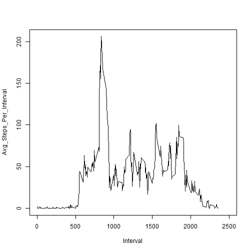
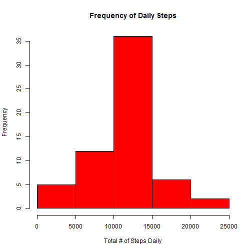
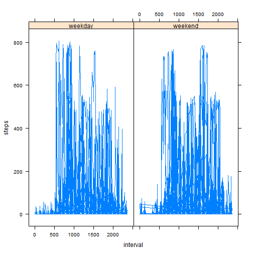

###What is the mean total number of steps taken per day?
The first part of this peer assessment is to compute the mean and median of the total number of steps every day. First, let's load the "Activity Monitoring" dataset and get a feel for the data.


```r
activity <- read.csv ("activity.csv")
str (activity)
```

```
## 'data.frame':	17568 obs. of  3 variables:
##  $ steps   : int  NA NA NA NA NA NA NA NA NA NA ...
##  $ date    : Factor w/ 61 levels "2012-10-01","2012-10-02",..: 1 1 1 1 1 1 1 1 1 1 ...
##  $ interval: int  0 5 10 15 20 25 30 35 40 45 ...
```


After loading the dataset, we can now calculate the total number of steps taken per day and plot a histogram showing this.


```r
total_steps <- tapply (activity$steps, activity$date, sum, na.rm = TRUE)
total_steps_df <- as.data.frame (total_steps)
colnames (total_steps_df) <- c ("Steps")
head (total_steps_df)
```

```
##            Steps
## 2012-10-01     0
## 2012-10-02   126
## 2012-10-03 11352
## 2012-10-04 12116
## 2012-10-05 13294
## 2012-10-06 15420
```

```r
hist (total_steps_df$Steps, main = "Frequency of Daily Steps", xlab = "Total # of Steps Daily", col = "red")
```

 

From the histogram, the 10,000-15,000 step range has the highest frequency.

Let's now calculate the mean and median total number of steps taken per day. 


```r
activity_steps <- subset (activity, steps != "NA")
summary(activity_steps$steps)
```

```
##    Min. 1st Qu.  Median    Mean 3rd Qu.    Max. 
##    0.00    0.00    0.00   37.38   12.00  806.00
```


###What is the average daily activity pattern?
The second part of this assignment is to create a time series plot of all the 5-minute intervals and the corresponding average number of steps taken, averaged across all days. First, let's compute the average number of steps taken for each 5-minute interval.


```r
interval_avg <- aggregate (activity$steps, list(activity$interval), mean, na.rm = TRUE)
colnames (interval_avg) <- c ("Interval", "Avg_Steps")
head (interval_avg)
```

```
##   Interval Avg_Steps
## 1        0 1.7169811
## 2        5 0.3396226
## 3       10 0.1320755
## 4       15 0.1509434
## 5       20 0.0754717
## 6       25 2.0943396
```

Now, let's create the time series plot.


```r
Interval <- ts (interval_avg$Interval)
Avg_Steps_Per_Interval <- ts (interval_avg$Avg_Steps)
plot.ts (Interval, Avg_Steps_Per_Interval, , xlim = c (0, 2500), type = "l")
```

 

The y-axis in the plot above shows the average number of steps for each 5-minute interval, where as the x-axis gives the intervals itself. The final time interval of each day is 2355, or 23:55/11:55 p.m.

From the time series plot, we can determine the 5-minute interval which has the highest or maximum number of steps.


```r
interval_avg [which (interval_avg$Avg_Steps == max (interval_avg$Avg_Steps)), ]
```

```
##     Interval Avg_Steps
## 104      835  206.1698
```

From the computation, that interval is 8:35 a.m.


###Imputing missing values
First, let's count the number of "NA's" in the "Activity" data set.


```r
summary(activity$steps)
```

```
##    Min. 1st Qu.  Median    Mean 3rd Qu.    Max.    NA's 
##    0.00    0.00    0.00   37.38   12.00  806.00    2304
```

The total number of missing values is 2304.

Next, let's fill in all the missing values in the dataset in order to reduce the bias that may have potentially crept in when the mean and median of the original data set were computed. Let's replace all the NA's with the mean for each corresponding 5-minute interval.


```r
library (plyr)
impute_mean <- function(x) replace(x, is.na(x), mean(x, na.rm = TRUE))
activity_new <-ddply (activity, "interval", transform, steps = impute_mean (steps))
activity_new <- activity_new [order(activity_new$date), ]
head (activity_new)
```

```
##         steps       date interval
## 1   1.7169811 2012-10-01        0
## 62  0.3396226 2012-10-01        5
## 123 0.1320755 2012-10-01       10
## 184 0.1509434 2012-10-01       15
## 245 0.0754717 2012-10-01       20
## 306 2.0943396 2012-10-01       25
```

With the new "Activity" dataset, we can repeat the first part of the assigment and calculate the total number of steps taken per day and plot a histogram showing this.


```r
total_steps_new <- tapply (activity_new$steps, activity_new$date, sum, na.rm = TRUE)
total_steps_new_df <- as.data.frame (total_steps_new)
colnames (total_steps_new_df) <- c ("Steps")
head (total_steps_new_df)
```

```
##               Steps
## 2012-10-01 10766.19
## 2012-10-02   126.00
## 2012-10-03 11352.00
## 2012-10-04 12116.00
## 2012-10-05 13294.00
## 2012-10-06 15420.00
```

```r
hist (total_steps_new_df$Steps, main = "Frequency of Daily Steps", xlab = "Total # of Steps Daily", col = "red")
```

 

From the histogram, again the 10,000-15,000 step range has the highest frequency.

Let's now calculate the new mean and median total number of steps taken per day. 


```r
summary(activity_new$steps)
```

```
##    Min. 1st Qu.  Median    Mean 3rd Qu.    Max. 
##    0.00    0.00    0.00   37.38   27.00  806.00
```

The new mean and median remain the same at 37.38 and 0.0, respectively, However, the impact of replacing missing data with the mean estimates is evidently clear in the new histogram plot, which shows the data in a much more normally distributed pattern.


###Are there differences in activity patterns between weekdays and weekends?
First, let's create a new factor variable "activity_new_day" in the dataset with 2 levels - 'weekday' and 'weekend' indicating whether a given date is a weekday or weekend day.


```r
weekdays <- c ("Monday", "Tuesday", "Wednesday"< "Thursday", "Friday")
activity_new_day <- factor ((weekdays (as.Date (activity_new$date)) %in% weekdays), levels = c (TRUE, FALSE), labels = c ("weekday", "weekend"))
activity_updated <- cbind (activity_new, activity_new_day)
head (activity_updated)
```

```
##         steps       date interval activity_new_day
## 1   1.7169811 2012-10-01        0          weekday
## 62  0.3396226 2012-10-01        5          weekday
## 123 0.1320755 2012-10-01       10          weekday
## 184 0.1509434 2012-10-01       15          weekday
## 245 0.0754717 2012-10-01       20          weekday
## 306 2.0943396 2012-10-01       25          weekday
```

Using the new "activity_updated" dataset, let's create a panel plot containing a time series plot of the 5-minute interval and the average number of steps taken, averaged across all weekday days or weekend days.


```r
library (lattice)
xyplot(steps ~ interval | activity_new_day, activity_updated, type = "l")
```

 

Looking at both plots, the user was generally more active during the time period of 5:00 - 10:00 am on weekdays commpared to weekends.

