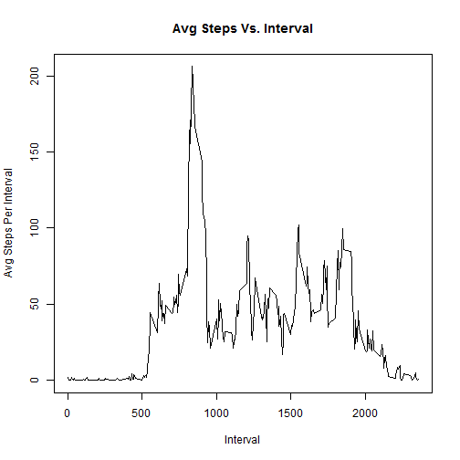

###Part 1: Loading and Preprocessing the data
Before performing any computations, let's load the "Activity Monitoring" dataset and get a feel for the data.


```r
activity <- read.csv ("activity.csv")
str (activity)
```

```
## 'data.frame':	17568 obs. of  3 variables:
##  $ steps   : int  NA NA NA NA NA NA NA NA NA NA ...
##  $ date    : Factor w/ 61 levels "2012-10-01","2012-10-02",..: 1 1 1 1 1 1 1 1 1 1 ...
##  $ interval: int  0 5 10 15 20 25 30 35 40 45 ...
```


###Part 2: What is the mean total number of steps taken per day?
After loading the dataset, we can now calculate the total number of steps taken per day and plot a histogram showing this.


```r
total_steps_daily <- aggregate (steps ~ date, activity, sum, na.rm = TRUE)
head (total_steps_daily)
```

```
##         date steps
## 1 2012-10-02   126
## 2 2012-10-03 11352
## 3 2012-10-04 12116
## 4 2012-10-05 13294
## 5 2012-10-06 15420
## 6 2012-10-07 11015
```

```r
hist (total_steps_daily$steps, col = "red", main = "Frequency vs. Daily Steps", xlab = "Total  Number of Steps Taken Each Day")
```

 

Based on the histogram above, the 10,000-15,000 step range has the highest frequency.

Additionally, we can also increase the number of bins in the histogram in order to get a more revealing distribution and better understand our data.


```r
histinfo <- hist (total_steps_daily$steps, col = "red", main = "Frequency vs Daily Steps", xlab = "Total  Number of Steps Taken Each Day", breaks = 11, axes = FALSE)
axis (side = 1, at = c (0, 2000, 4000, 6000, 8000, 10000, 12000, 14000, 16000, 18000, 20000, 22000), cex.axis = 0.70)
axis (side = 2, at = seq (0, 16, by = 4))
```

 

```r
histinfo
```

```
## $breaks
##  [1]     0  2000  4000  6000  8000 10000 12000 14000 16000 18000 20000
## [12] 22000
## 
## $counts
##  [1]  2  2  3  3  7 16 10  7  1  0  2
## 
## $density
##  [1] 1.886792e-05 1.886792e-05 2.830189e-05 2.830189e-05 6.603774e-05
##  [6] 1.509434e-04 9.433962e-05 6.603774e-05 9.433962e-06 0.000000e+00
## [11] 1.886792e-05
## 
## $mids
##  [1]  1000  3000  5000  7000  9000 11000 13000 15000 17000 19000 21000
## 
## $xname
## [1] "total_steps_daily$steps"
## 
## $equidist
## [1] TRUE
## 
## attr(,"class")
## [1] "histogram"
```

Looking at the second histogram now, the 10-12000 step range has the highest count.

Let's now calculate the mean and median total number of steps taken per day. 


```r
summary (total_steps_daily)
```

```
##          date        steps      
##  2012-10-02: 1   Min.   :   41  
##  2012-10-03: 1   1st Qu.: 8841  
##  2012-10-04: 1   Median :10765  
##  2012-10-05: 1   Mean   :10766  
##  2012-10-06: 1   3rd Qu.:13294  
##  2012-10-07: 1   Max.   :21194  
##  (Other)   :47
```

The median and mean total number of steps taken daily are 10765 and 10766, respectively. 


###Part 3: What is the average daily activity pattern?
The second part of this assignment is to create a time series plot of all the 5-minute intervals and the corresponding average number of steps taken, averaged across all days. First, let's compute the average number of steps taken for each 5-minute interval.


```r
int_avg <- aggregate (activity$steps, list (activity$interval), mean, na.rm = TRUE)
colnames (int_avg) <- c ("Interval", "Avg_Steps")
head (int_avg)
```

```
##   Interval Avg_Steps
## 1        0 1.7169811
## 2        5 0.3396226
## 3       10 0.1320755
## 4       15 0.1509434
## 5       20 0.0754717
## 6       25 2.0943396
```

Now, let's create the time series plot.


```r
plot (int_avg$Interval, int_avg$Avg_Steps, main = "Avg Steps Vs. Interval", xlab = "Interval", ylab = "Avg Steps Per Interval", type = "l")
```

 

The y-axis in the plot above shows the average number of steps for each 5-minute interval, whereas the x-axis lists the intervals. The final time interval of each day is 2355, or 23:55/11:55 p.m.

From the time series plot, we can determine the 5-minute interval which has the highest or maximum number of steps.


```r
subset (int_avg, Avg_Steps == max (Avg_Steps))
```

```
##     Interval Avg_Steps
## 104      835  206.1698
```

The interval in question is 8:35 a.m.


###Part 4: Imputing missing values
First, let's count the number of "NA's" in the "Activity" data set.


```r
summary(activity$steps)
```

```
##    Min. 1st Qu.  Median    Mean 3rd Qu.    Max.    NA's 
##    0.00    0.00    0.00   37.38   12.00  806.00    2304
```

The total number of missing values is 2304.

Next, let's fill in all the missing values in the dataset in order to reduce the bias that may have potentially crept in when the mean and median of the original data set were computed. Let's replace all the NA's with the mean for each corresponding 5-minute interval.


```r
library (plyr)
impute_mean <- function(x) replace(x, is.na(x), mean(x, na.rm = TRUE))
activity_new <-ddply (activity, "interval", transform, steps = impute_mean (steps))
activity_new <- activity_new [order(activity_new$date), ]
head (activity_new)
```

```
##         steps       date interval
## 1   1.7169811 2012-10-01        0
## 62  0.3396226 2012-10-01        5
## 123 0.1320755 2012-10-01       10
## 184 0.1509434 2012-10-01       15
## 245 0.0754717 2012-10-01       20
## 306 2.0943396 2012-10-01       25
```

Using the newly created dataset, let's repeat the first part of the assigment and calculate the total number of steps taken per day. Next, plot a histogram showing the new data set and compare it with the first histogram.


```r
new_total_daily <- tapply (activity_new$steps, activity_new$date, sum)
head (new_total_daily)
```

```
## 2012-10-01 2012-10-02 2012-10-03 2012-10-04 2012-10-05 2012-10-06 
##   10766.19     126.00   11352.00   12116.00   13294.00   15420.00
```

```r
hist (total_steps_daily$steps, col = "red", main = "Frequency vs. Daily Steps (Before Imputing Interval Mean)", xlab = "Total  Number of Steps Taken Each Day")
```

 

```r
hist (new_total_daily, col = "lightblue", main = "Frequency vs. Daily Steps (After Imputing Interval Mean)", xlab = "Total  Number of Steps Taken Each Day")
```

 

In the first part of the assignment, I created a second histogram using additional bins. Let's make a comparison for this too.


```r
hist (total_steps_daily$steps, col = "red", main = "Frequency vs Daily Steps (Before Imputing Interval Mean)", xlab = "Total  Number of Steps Taken Each Day", breaks = 11, axes = FALSE)
axis (side = 1, at = c (0, 2000, 4000, 6000, 8000, 10000, 12000, 14000, 16000, 18000, 20000, 22000), cex.axis = 0.70)
axis (side = 2, at = seq (0, 16, by = 4))
```

 

```r
histinfo_2 <- hist (new_total_daily, col = "lightblue", main = "Frequency vs Daily Steps (After Imputing Interval Mean)", xlab = "Total  Number of Steps Taken Each Day", breaks = 11, axes = FALSE)
axis (side = 1, at = c (0, 2000, 4000, 6000, 8000, 10000, 12000, 14000, 16000, 18000, 20000, 22000), cex.axis = 0.70)
axis (side = 2, at = seq (0, 24, by = 4))
```

 

```r
histinfo_2
```

```
## $breaks
##  [1]     0  2000  4000  6000  8000 10000 12000 14000 16000 18000 20000
## [12] 22000
## 
## $counts
##  [1]  2  2  3  3  7 24 10  7  1  0  2
## 
## $density
##  [1] 1.639344e-05 1.639344e-05 2.459016e-05 2.459016e-05 5.737705e-05
##  [6] 1.967213e-04 8.196721e-05 5.737705e-05 8.196721e-06 0.000000e+00
## [11] 1.639344e-05
## 
## $mids
##  [1]  1000  3000  5000  7000  9000 11000 13000 15000 17000 19000 21000
## 
## $xname
## [1] "new_total_daily"
## 
## $equidist
## [1] TRUE
## 
## attr(,"class")
## [1] "histogram"
```

For the first histogram, the 10,000-15,000 step range has the highest frequency, just like its counterpart in part 1. This is also true for the second histogram, where the 10-12000 step range has the highest count.

Let's now calculate the new mean and median total number of steps taken per day. 


```r
summary(new_total_daily)
```

```
##    Min. 1st Qu.  Median    Mean 3rd Qu.    Max. 
##      41    9819   10770   10770   12810   21190
```

The new mean and median are both 10770, which are both very similiar to the first mean (10766) and median (10765). The impact of imputing missing data with the mean estimates is evident in both new histograms, where the distribution is more concentrated around the mean and median of the sample data.


###Part 5: Are there differences in activity patterns between weekdays and weekends?
First, let's create a new factor variable in the dataset with 2 levels - 'weekday' and 'weekend', indicating whether a given date is a weekday or weekend day.


```r
wkday <- c ("Monday", "Tuesday", "Wednesday", "Thursday", "Friday")
Day_Type <- factor ((weekdays (as.Date (activity_new$date)) %in% wkday), levels = c (TRUE, FALSE), labels = c ("weekday", "weekend"))
final_activity <- as.data.frame (cbind (activity_new, Day = weekdays (as.Date (activity_new$date)), Day_Type))
head (final_activity)
```

```
##         steps       date interval    Day Day_Type
## 1   1.7169811 2012-10-01        0 Monday  weekday
## 62  0.3396226 2012-10-01        5 Monday  weekday
## 123 0.1320755 2012-10-01       10 Monday  weekday
## 184 0.1509434 2012-10-01       15 Monday  weekday
## 245 0.0754717 2012-10-01       20 Monday  weekday
## 306 2.0943396 2012-10-01       25 Monday  weekday
```

Using the new dataset, let's create a time series panel plot of the average number of steps taken for each 5-minute interval, averaged across all weekday and weekend days.


```r
int_wkday <- subset (final_activity, Day_Type == "weekday")
int_wkend <- subset (final_activity, Day_Type == "weekend")

int_wkday_avg <- aggregate (int_wkday$steps, list (int_wkday$interval), mean)
colnames (int_wkday_avg) <- c ("Interval", "Avg_Steps")
int_wkend_avg <- aggregate (int_wkend$steps, list (int_wkend$interval), mean)
colnames (int_wkend_avg) <- c ("Interval", "Avg_Steps")

int_wkday_df <- cbind (int_wkday_avg, Day_Type = "weekday")
int_wkend_df <- cbind (int_wkend_avg, Day_Type = "weekend")
int_final <- rbind (int_wkday_df, int_wkend_df)

library (lattice)
int_final <- transform (int_final, Day_Type = factor (Day_Type))
head (int_final)
```

```
##   Interval  Avg_Steps Day_Type
## 1        0 2.25115304  weekday
## 2        5 0.44528302  weekday
## 3       10 0.17316562  weekday
## 4       15 0.19790356  weekday
## 5       20 0.09895178  weekday
## 6       25 1.59035639  weekday
```

```r
xyplot(Avg_Steps ~ Interval | Day_Type, int_final, ylab = "Avg Steps Per Interval", type = "l", layout = c (1, 2))
```

 

Looking at the panel plot, the user is more active during the 8:00-9:30 am time period on weekdays. However, more activity (steps) is oberserved during the 12:30-17:30 time period during the weekends.

